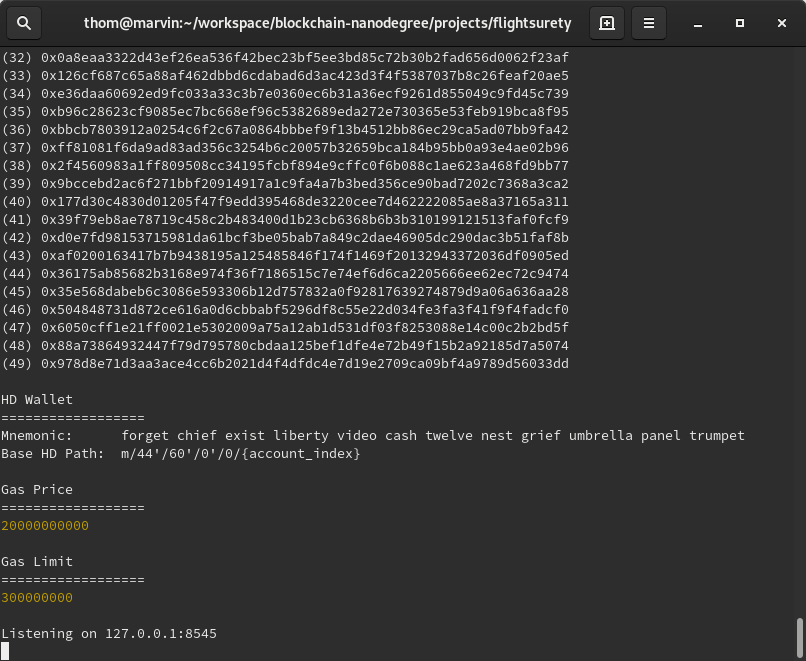
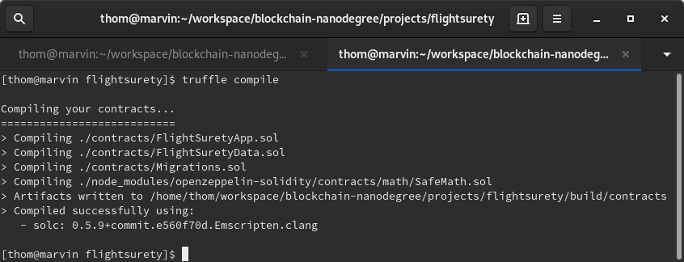
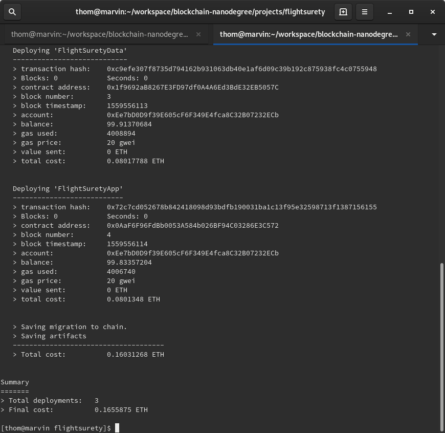
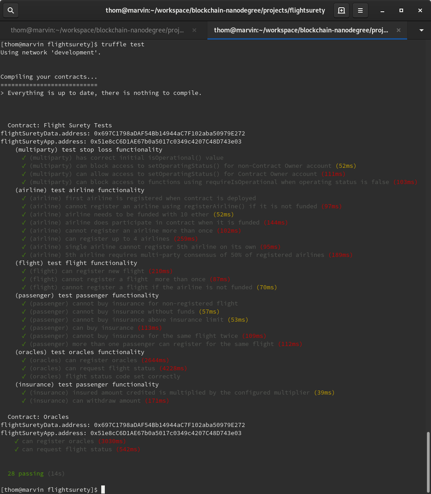

# Udacity Blockchain Developer Nanodegree Program - Project 8: FlightSurety

FlightSurety is a sample application project for Udacity's Blockchain course. 

This repository contains smart contract code in Solidity (using Truffle), tests (also using Truffle), DApp (using HTML, CSS and JS) and server application.

## Install

To install, download or clone the repository and install all requisite npm packages (as listed in ```package.json```)::

```
npm install
```

Fix the pragma in ```node_modules/openzeppelin-solidity/contracts/math/SafeMath.sol```:

```
pragma solidity ^0.5.0;
```

Launch Ganache:

```ganache-cli  --gasLimit 300000000 --gasPrice 20000000000 -a 50 -m "forget chief exist liberty video cash twelve nest grief umbrella panel trumpet"```

Your terminal should look something like this:



In a separate terminal window, compile the smart contracts:

```
truffle compile
```

Your terminal should look something like this:



This will create the smart contract artifacts in folder build/contracts.

Migrate smart contracts to the locally running blockchain, ganache-cli:

```truffle migrate```

Your terminal should look something like this:



Test smart contracts:

```truffle test```

All 28 tests should pass.



## DApp

### Client

To use the Dapp:

```
npm run dapp
```

To view the DApp:

```
http://localhost:8000
```

### Server

```
npm run server
```

### Deploy

To build the DApp for production:

```
npm run dapp:prod
```

Deploy the contents of the ```./dapp``` folder

## Requirements

Graded according to the [Project Rubric](https://review.udacity.com/#!/rubrics/1711/view).

### Requirement 1: Separation of concerns

* FlightSuretyData contract for data persistence
* FlightSuretyApp contract for app logic and oracles code
* DApp client for triggering contract calls
* Server app for simulating oracles

### Requirement 2: Airlines

* Register first airline when contract is deployed
* Only existing airline may register a new airline until there are at least four airlines registered
* Registration of fifth and subsequent airlines requires multi-party consensus of 50% of registered airlines
* Airline can be registered, but does not participate in contract until it submits funding of 10 ether

### Requirement 3: Passengers

* Passengers may pay up to 1 ether for purchasing flight insurance
* Flight numbers and timestamps are fixed for the purpose of the project and can be defined in the DApp client
* If the flight is delayed due to airline fault, passenger receives credit of 1.5x the amount they paid
* Funds are transfered from contract to the passenger wallet only when they initiate a withdrawal

### Requirement 4: Oracles

* Oracles are implemented as a server app
* Upon startup, 20+ oracles are registered and their assigned indexes are persisted in memory
* Client DApp is used to trigger request to update flight status generating OracleRequest event that is captured by server
* Server will loop through all registered oracles, identify those oracles for which the request applies, and respond by calling into app logic contract with the appropriate status code

### Requirement 5: General

* Contracts must have operational status control
* Functions must fail fast - use require() at the start of functions
* Scaffolding code is provided but you are free to replace it with your own code

## Resources

* [How does Ethereum work anyway?](https://medium.com/@preethikasireddy/how-does-ethereum-work-anyway-22d1df506369)
* [BIP39 Mnemonic Generator](https://iancoleman.io/bip39/)
* [Truffle Framework](http://truffleframework.com/)
* [Ganache Local Blockchain](http://truffleframework.com/ganache/)
* [Remix Solidity IDE](https://remix.ethereum.org/)
* [Solidity Language Reference](http://solidity.readthedocs.io/en/v0.4.24/)
* [Ethereum Blockchain Explorer](https://etherscan.io/)
* [Web3Js Reference](https://github.com/ethereum/wiki/wiki/JavaScript-API)

## Versions

* Truffle v5.0.18 (core: 5.0.18)
* Solidity - ^0.5.0 (solc-js)
* Node v10.15.3
* Web3.js v1.0.0-beta.37